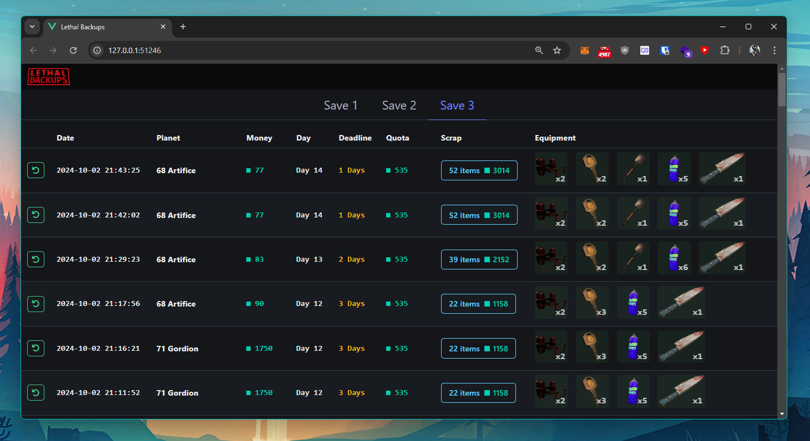

# Lethal Backups

**Lethal Backups** is a save manager for the game [Lethal Company](https://store.steampowered.com/app/1966720/Lethal_Company/).  

Features:  
- It automatically backups your saves: every 5 seconds.
- You can restore any save to a previous state.
- Nice user interface that shows extra infos: items, equipment, money, days, etc...

Gotchas:
- Will not backups your saves when the program is closed: **keep it running in the background!**  
It's designed to run in the background **while playing**, so that every step of your progress is kept safe and secure.  
- May have bugs.  
- Not compatible with mods that save extra data outside of the main save files.  

